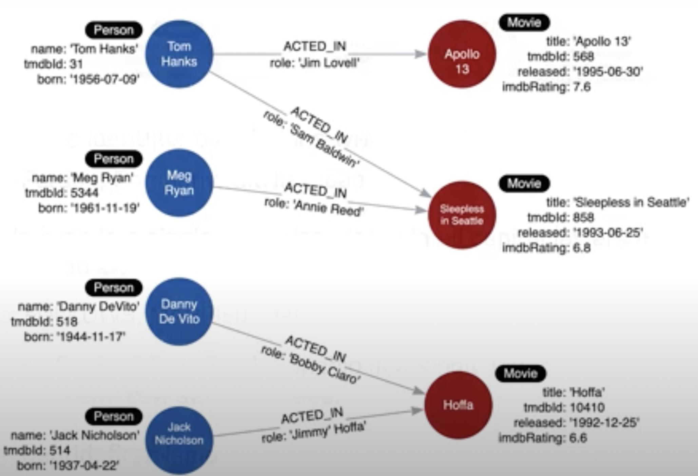

# Graph Data Modeling

- [Neo4j Graph Academy](https://graphacademy.neo4j.com/courses/modeling-fundamentals/1-getting-started/1-what-is-modeling)

### Domain Knowledge
- It’s essential for graph modeling
- To understand the domain for your application, you should:
	- Identify the stakeholders and developers for the application
	- With the stakeholders and developers
		- Describe the application in detail
		- Identify the users of the application (users, systems)
		- Agree upon the use-cases of the application. (You can think of this as the “questions that will be be attempted against the app”)
		- Rank the importance of the use-cases. Some of them are more important than others

#### Two types of models

##### 1. Data Model
- It describes the labels, properties and relationships in the graph. It does **NOT** have specific data that will be created in the graph. 
- It is important to agree on the **NAMING** of labels, relationships and properties. 
	- Style guidelines for modeling:
		- A label isa single identifies that begins with a capital letter and can be CamelCase
		- A relationship type is a single identifier that is in all capital letters with he underscore character. 
		- A property key for a node or relationship is a single identifier that starts with a lower-case letter and can be `camelCase`. Property names don’t need to be unique for each node

##### 2. Instance Model
- An “instantiation” of the model with sample data to make sue that the use-case can be answered with out current graph model

