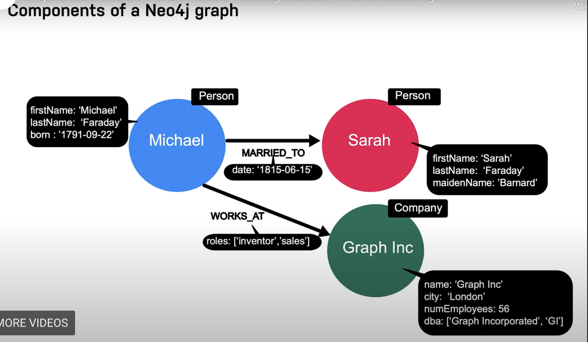
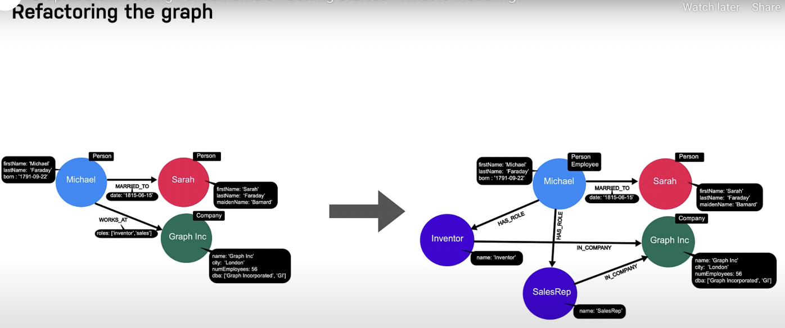

# Why to model?

- [Neo4j Graph Academy](https://graphacademy.neo4j.com/courses/modeling-fundamentals/1-getting-started/1-what-is-modeling)

#### Why to model?
- You need to collaborate with business stakeholders and PMs to come up with a graph model that:
- Answer the key use-cases for the application
- Provide the best Cypher query performance for these use-cases

#### Data Modeling Process
1. Understand the domain and define specific use-cases (questions for the application)
2. Develop the initial graph data model:
	- Model the nodes (entities)
	- Model the relationships between nodes
3. Test the use-cases against the initial data model
4. Create the graph (instance model) with test data using Cypher
5. Test the use-cases, including performance against the graph
6. Refactor the graph data model due to a change in the key use-cases or for performance reasons.
7. Implement the refactoring on the graph and re-test using Cypher

The Cypher language (and Neo for that matter) allows you to easily modify the graph model. A Relational schema is not as flexible.