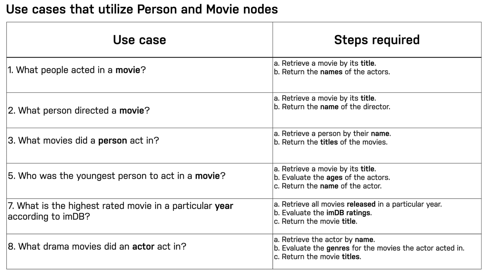

# Modeling Nodes

- [Neo4j Graph Academy](https://graphacademy.neo4j.com/courses/modeling-fundamentals/1-getting-started/1-what-is-modeling)

### Defining labels
- Dominant entities in use-cases are modeled as LABELS for nodes (Think of the **NOUNS** present in the use-cases statements)
	- What **ingredients** are used in a **recipe**?
	- Who is married to this **person**?
	- What **movies** did a **person** acted in?

**Node properties are used to**:
- Identify a node
- Answer specific details of the use-cases of the application
- Return property values

Evaluate the steps required to satisfy the use-cases using Cypher language
(Cypher developers are important to participate on this stage)



Example of creating new user in “Movies Database”
```
MERGE (u:User {userId: 534})
SET u.name = "Sandy Jones"
```